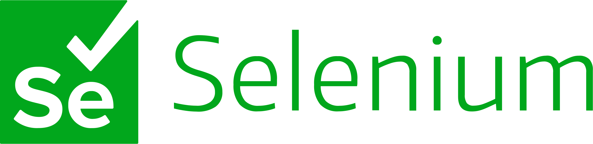

Salut, je suis Houcine Boumediene Merouane
===================================================================================================================================================

Data Analyst/Scientist
----------------------

Après une carrière en tant qu'enseignant chercheur en mathématiques appliquées et fort d'une expérience en développement, je me suis orienté vers une reconversion professionnelle en tant que data analyst, voire scientist.

🌠 Je réside actuellement à Villeurbanne-Lyon, en France. 
✉️  Vous pouvez me joindre à l'adresse [HBMerouane@Gmail.com](mailto:HBMerouane@Gmail.com) 
🚀  En ces moments, j'améliore mes compértences en data science.  
🧠  Je tests actuellement Google Kaggle.  
🤠 Je suis ouvert à toute collaboration.  
⚡  Je suis en quête d'un poste ou d'un projet intéressant.

### Skills 

 

  
      
  
    
      

                    
### Tools 

       

  
  
      
    

### Socials
                  

 <a href="https://discord.com/users/elho111" target="_blank" rel="noreferrer"> <picture> <source media="(prefers-color-scheme: dark)" srcset="undefined" /> <source media="(prefers-color-scheme: light)" srcset="socials/discord.svg" />  </picture> </a> <a href="https://www.github.com/elho2007" target="_blank" rel="noreferrer"> <picture> <source media="(prefers-color-scheme: dark)" srcset="socials/github-dark.svg" /> <source media="(prefers-color-scheme: light)" srcset="socials/github.svg" />  </picture> </a> <a href="https://www.linkedin.com/in/houcine-boumediene-merouane" target="_blank" rel="noreferrer"> <picture> <source media="(prefers-color-scheme: dark)" srcset="socials/linkedin-dark.svg" /> <source media="(prefers-color-scheme: light)" srcset="socials/linkedin.svg" />  </picture> </a>

